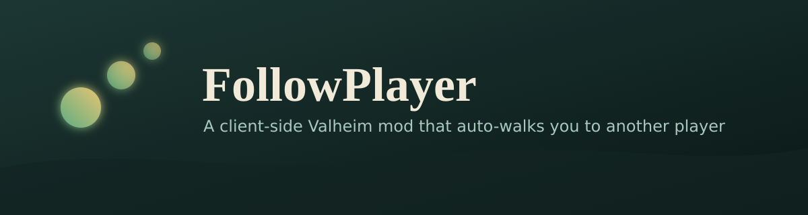

<p align="center">
  
</p>

<p align="center">
  <a href="https://github.com/Firelashes/FollowPlayer/actions/workflows/build.yml"></a>
  <a href="https://github.com/Firelashes/FollowPlayer/releases/latest"></a>
  <a href="LICENSE"></a>
</p>

A client-side Valheim mod that lets you auto-walk toward and trail another player. Type a chat command and your character paths toward a target player so you can take your hands off the keyboard while still being able to fight.

This is client-side only. It drives your own character's movement, which the base game already replicates to other players, so no one else on the server needs the mod.

## Features

- Toggle follow on or off with `/follow`.
- Cycle through nearby players to pick a target with `/follownext`.
- Turning follow on with no target picks whichever nearby player you're facing, not just the closest one.
- Moving, attacking, or blocking yourself turns follow off; run `/follow` again to resume. Jumping, crouching, etc. don't interrupt it.
- A "Following: `<name>`" indicator stays in the top-right corner of the screen while follow is active.
- Configurable stop distance (how close you trail) and run distance (when the follower breaks into a run).

## Installation

1. Install [BepInEx for Valheim](https://valheim.thunderstore.io/package/denikson/BepInExPack_Valheim/).
2. Download `FollowPlayer.dll` from the [latest release](https://github.com/Firelashes/FollowPlayer/releases/latest), or build it yourself (see [Building](#building)).
3. Drop `FollowPlayer.dll` into `BepInEx/plugins/`.

## Usage

- `/follow` — toggle following on or off. Turning it on targets whichever nearby player you're facing.
- `/follownext` — cycle to the next nearby player.

## Configuration

A config file is generated after the first run at `BepInEx/config/FollowPlayer.cfg`.

| Setting | Default | Description |
| --- | --- | --- |
| StopDistance | 4 | Stop this many meters short of the target. |
| RunDistance | 8 | Beyond this distance the follower runs. |

## Building

Requires the .NET SDK. The project pulls the game, Unity, and BepInEx assemblies from NuGet, so no manual DLL copying is needed.

```
dotnet build -c Release
```

If the restore cannot locate your game install, set `VALHEIM_INSTALL` to your install path first, for example on Linux:

```
export VALHEIM_INSTALL="$HOME/.local/share/Steam/steamapps/common/Valheim"
dotnet build -c Release
```

The built DLL lands in `bin/Release/net462/FollowPlayer.dll`.

## Known limitations

Following is straight-line, so the follower can snag on trees, boulders, and steep terrain. A future version can path through Valheim's own navigation (`Pathfinding.instance.GetPath`) and steer toward waypoints instead of straight at the target.

## License

MIT. See [LICENSE](LICENSE).
